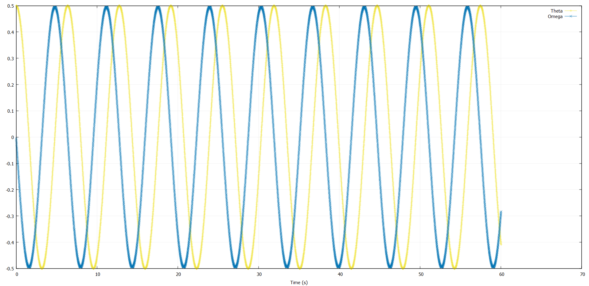
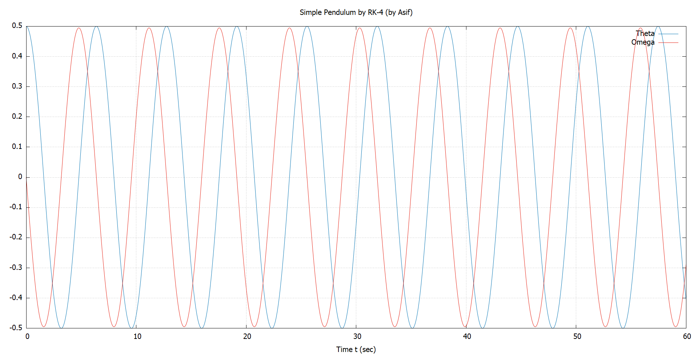
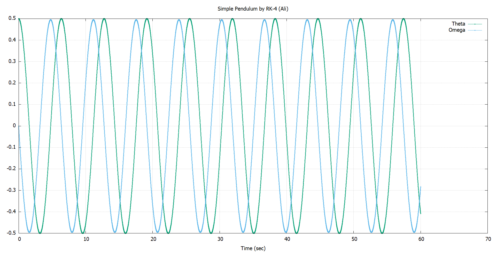

# Simple Pendulum 

## Simulate the simple pendulum using RK-4.

## General Instruction:
1. Code name: Firstname_SimplePendulum.f90, Result file with (t,θ,ω): Pendulum_RK4.txt
2. Use: dt=0.01, tmax=60 s, l=g=9.8 .
3. Initial conditions: displacement=0.5 rad, angular velocity=0 rad/s
4. Make sure that the pendulum is nonlinear (use sin(theta)).

### Plots:

